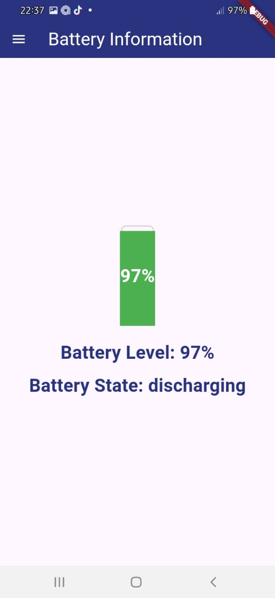
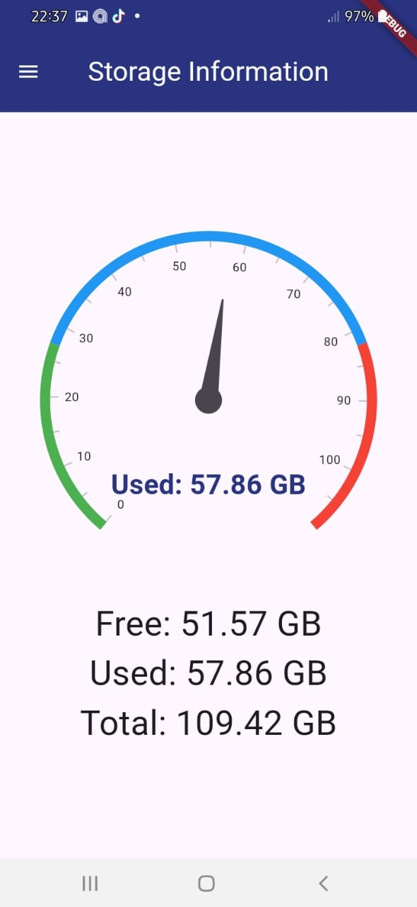
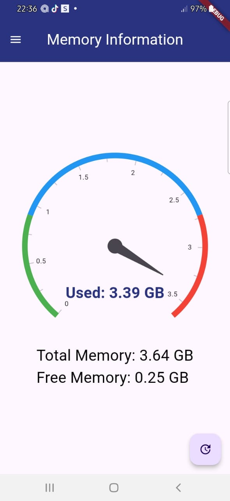
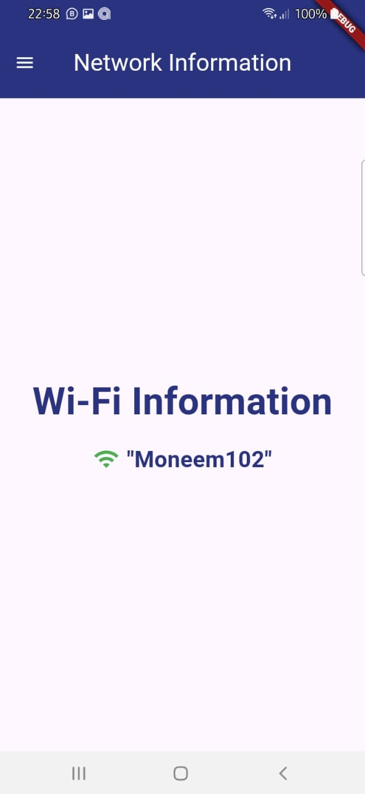
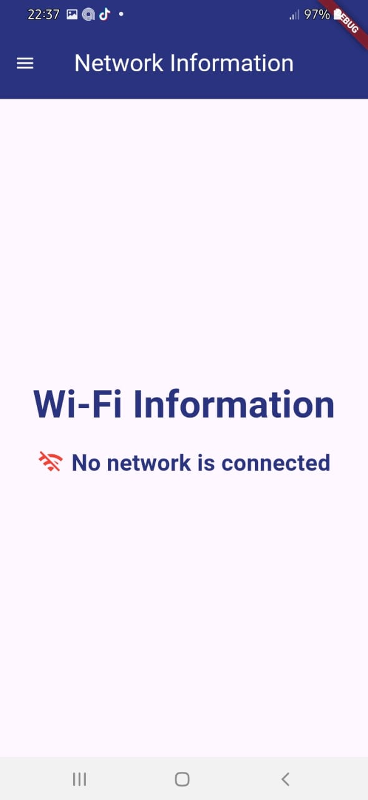

# AI-Mobile-Performance-Monitor-Application

## Table of Contents

- [Overview](#overview)
- [AI Model and Development](#ai-model-and-development)
- [Features](#features)
- [Mobile App UI Overview](#mobile-app-ui-overview)
- [Technology Used](#technology-used)
- [Steps to Run the Project](#steps-to-run-the-project)
- [Demo Link](#demo-link)

# Overview

This application empowers users to gain real-time insights into their mobile device's performance and engage in insightful conversations with an AI model for deeper investigation. It provides a user-friendly interface for monitoring key metrics such as battery level, storage usage, memory consumption, and network activity.

# AI Model and Development

This application utilizes a hybrid approach for its AI functionality, leveraging both offline and online capabilities.

**Offline Mode:**

- **Model:** The offline mode utilizes **Gemma** model, which is a family of lightweight, open models built from the research and technology that Google used to create the Gemini models.We used **Gemma-2B"** model.
- **Quantization:**  The model has been quantized to 4 bits to optimize its size and performance for mobile environments [Gemma-2B-it-cpu-int4](https://www.kaggle.com/models/google/gemma/tfLite/gemma-2b-it-cpu-int4).
- **Key Point:** The model was generated using [MediaPipe](https://ai.google.dev/edge/mediapipe/solutions/genai/llm_inference), which is  LLM Inference API lets you run large language models (LLMs) in form of **TensorFlow Lite** model completely on-device.With MediaPipe, a wide range of tasks can be preformed ,such as generating text, retrieving information in natural language form, and summarizing documents. 

**Online Mode:**

- **Integration:** For online functionality, the application integrates with the **OpenAI API**, allowing access to a more powerful and up-to-date AI model.
- **Model:** The online mode utilizes the **GPT-4-mini** API, which provides a more advanced and feature-rich AI experience.

**Development:**

- **Framework:** The mobile application is built using the **Flutter** framework, providing a robust and efficient solution for Android devices.

By combining offline and online capabilities, this application provides a user experience with both immediate responses and access to the latest AI advancements.

# Features

- **Real-time Performance Monitoring:** Track battery level, storage usage, memory consumption, and network activity in real-time.
- **AI-Powered Insights:** Get personalized insights and predictions about your device's performance from an AI model. 
- **Offline Mode:** Access basic performance monitoring even when you are not connected to the internet.
- **User-Friendly Interface:** Navigate the application with ease.

# Mobile App UI Overview

This section displays a collection of images showcasing the user interface of the mobile application.

<p align="center">
  
   &nbsp; &nbsp; &nbsp; &nbsp;
   
</p>

<p align="center">
  
   &nbsp; &nbsp; &nbsp; &nbsp;
   
</p>

<p align="center">
  
   &nbsp; &nbsp; &nbsp; &nbsp;
   
</p>

  <p align="center">
  
   &nbsp; &nbsp; &nbsp; &nbsp;
</p>


# Technology Used

- **AI Model:** Gemma-2B-int4 
- **OpenAI API:** For online AI interactions 
- **Flutter Framework:** Cross-platform mobile development framework 


# Steps to Run the Project

This section will walk you through the process of running the application.

1. **Clone the Project Repository**
   - Start by cloning the project repository to your local machine. Open your terminal and run the following command:
       ` git clone https://github.com/Habibafathalla/AI-Mobile-Performance-Monitor-Application.git ` then `git checkout master`
   -  Navigate into the cloned project directory:
       `cd <project-directory>`
   -  Once downloaded, extract the file (the model name.bin) from the compressed archive if necessary.

2. **Download the AI Model**
   -  Visit the following link: [Gemma-2B-it-cpu-int4](https://www.kaggle.com/models/google/gemma/tfLite/gemma-2b-it-cpu-int4).
   -  Download the quantized AI model file from the page. This model is optimized for mobile use and comes in a compressed TensorFlow Lite format.
   -  Once downloaded, extract the file (the model name.bin) from the compressed archive if necessary.
3. **Add the Model to Your Application's Assets**
     - Locate the assets directory in your Flutter project. This is where you will store resources like images, fonts, and model files.
     - Move the downloaded model.bin file to the assets folder.
     -   ```
         project-root/
         ├── assets/
         │   └── model.bin
         │   └── images
         │       └── ...
         ├── lib/
         ├── pubspec.yaml
         └── ...
         ```

4. **Update Pubspec.yaml File**
      - Navigate to the `pubspec.yaml` file, located in the root of your Flutter project.
      - Under the `flutter` section, add the `assets` field to register your model file as an asset. This step ensures that Flutter can access the model during runtime.
      -  ```
         flutter:
         ├── assets:
         │   └── - assets/model.bin
         │   └── - assets/images/performance-monitor_logo.png
         │   └── - assets/images/cpu.png

         ```
      - After saving the changes, run `flutter pub get` to install the dependencies
5. **Run the Application**
      - Execute `flutter run` to start the application.
   
**Important**: The model is stored in the system files and is loaded only once during installation. You do not need to reload it every time you start the application.

# [Demo Link](https://drive.google.com/drive/folders/1dvkNc-ZVnuyaJQm4JQw9Iv0rdyWgibOL?usp=sharing)
